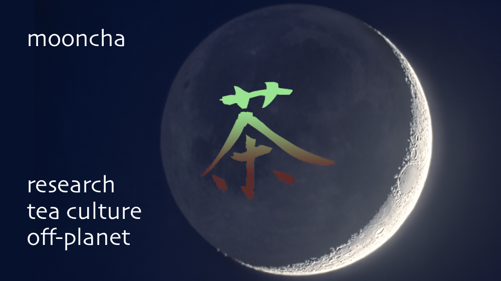

# mooncha
Growing tea experiment for cultivation off Earth

Humans will move off-Earth and start living in space, both on space based stations and on other celestial bodies. 
The Moon is the first and most logical target for human settling.
Research in many different areas of science has been ongoing to learn about how humans can survive and thrive off-Earth.
This includes studying how plants grow in other conditions.
Plants will be essential for the success of any settlement off-planet for growing food and create medicine. 
Fast growing foods with high nutritious content (tomato, carrot, lettuce, spinach, etc.),
as well as herbs and mushrooms that can be used have been the main focus to date of the research activities.

The goal of this experiment is to study in what way the **Camellia Sinensis** ,
better known as the tea plant, could be cultivated on the Moon.
The Camellia Sinensis is an evergreen shrub of the Theaceae Family.
It is neither fast growing, nor specifically nutritious, so that it will not be the first choice when considering plants to grow off-planet.
It does have beneficial health characteristics (*i.e.* anti-oxidants), and the preparation and drinking of made tea (tea leaves ready for brewing)
can have a positive calming socio-psychological effect.
Tea has been praised for these characteristics for millennia.
Together with the cultural value of tea world wide this make it worth studying the potential for growing and cultivating Camellia Sinensis
(both the Sinensis and the Assamica variety) on the Moon.
 
 
