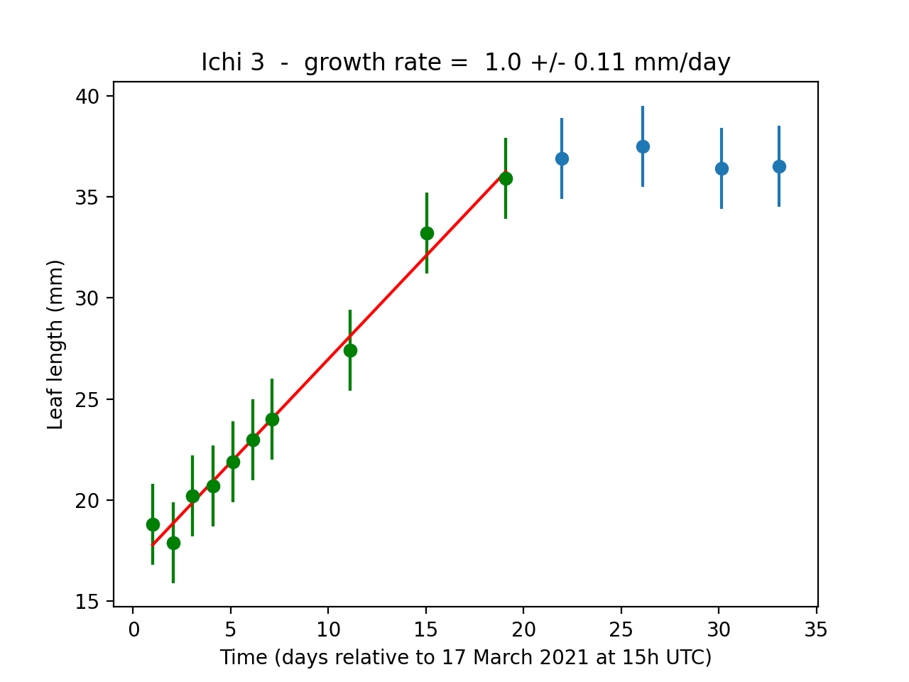
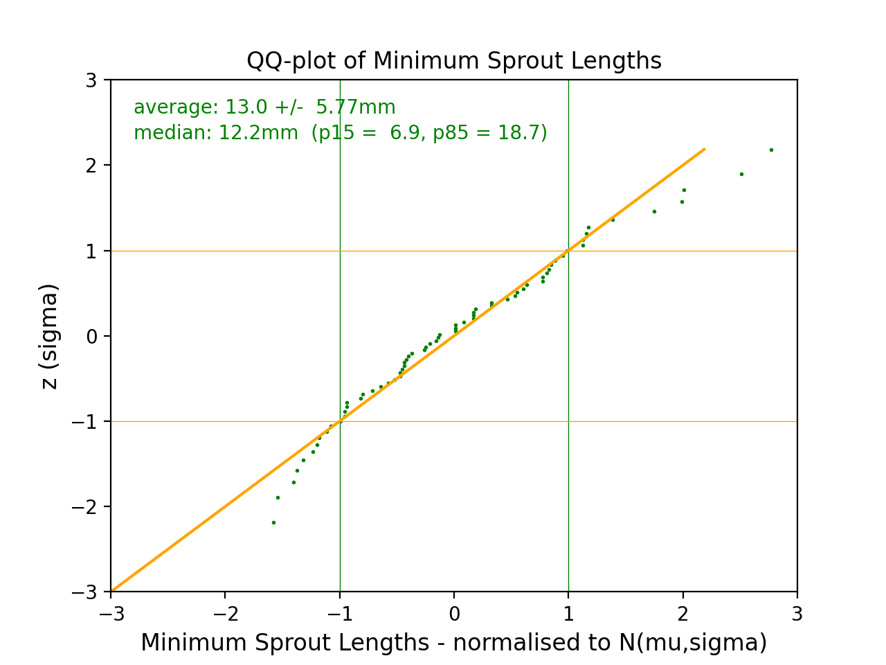
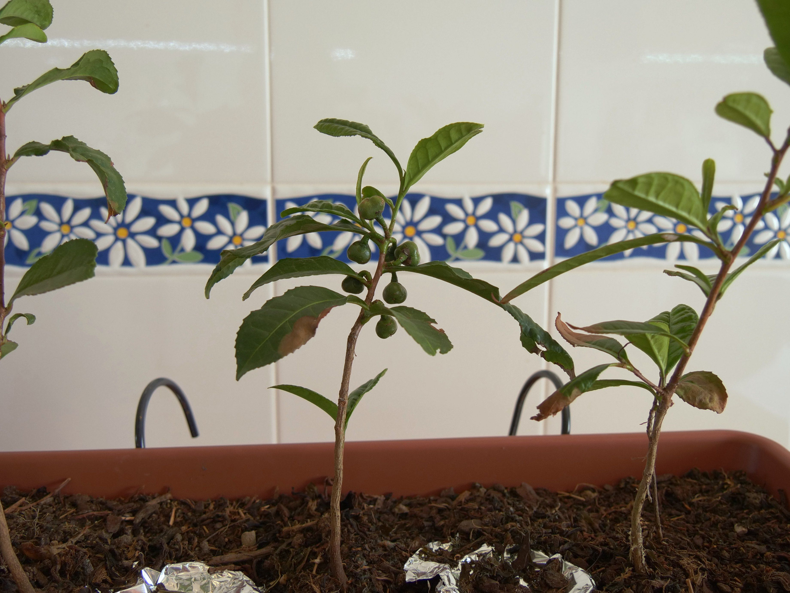

The Zeroth experiment 
=====================

.. COMMENTED OUT

    Go to :ref:`last point of work <lastPointOfWork>`.
    
    .. image:: ./images/construction.png
        :scale: 50%

Code and Data
-------------

In the :file:`code`, :file:`data` and :file:`plots` folders in this repository are the Python scripts, resulting data and corresponding plots. This was written some years ago and the scripts need to be reviewed and better commented. 

Data and Access
---------------

The plants used in this experiment originate from the `Cha Camélia <https://chacamelia.com>`__ tea farm in Northern Portugal. 

All files can be found in `Google Drive folder <https://drive.google.com/drive/folders/1QKy8gKy13t4JcW88e84t-2N_utGdjZH2?usp=sharing>`_. 

Data and logging for Part 0 of the experiment has been recorded in the
`Google Sheet Camelia Sinensis Plants Growth Record <https://docs.google.com/spreadsheets/d/1ntlmHU08fXxTGP2OXaCjA-mltcWuFbqVk_G0L2pNAx0/edit?usp=sharing>`_.
All photos can be found in the `Camellia Sinensis Experiment Images folder <https://drive.google.com/drive/folders/1AnzG5z34VKsHMHXcS_OlKxZMxUPTjNXQ?usp=sharing>`_.
The files corresponding to the analysis of Part 0 are in the Analysis folder.
This includes all the plots of the growth curves of the individual sprouts 
(`20210317-20210419 Plots <https://drive.google.com/drive/folders/1R9i5UBRTl2MD6vNl89SKSRD--ke0G9lz?usp=sharing>`_ and 
`20210701-20210901 Plots <https://drive.google.com/drive/folders/1-FQPgCzYk3-nr0ycO8C3mAyYktyGPC4I?usp=sharing>`_
and tables with the reduced data and the python scripts to produce the numbers and plots.

Acknowledgements
----------------

The Camellia Sinensis Sinensis plants used in this experiment were kindly provided by the `Cha Camélia <https://chacamelia.com>`__ tea farm in Northern Portugal.
MR is also grateful for the feedback from the `Cha Camélia <https://chacamelia.com>`__ team  concerning several questions that arose during the experiment. 

Part I: Baseline
-----------------

Experimental Setup
^^^^^^^^^^^^^^^^^^

The goal of the first part of the experiment is to gain understanding of the growth parameters under normal conditions of a Camellia Sinensis Sinensis (L.) O. Kuntze,
by measuring the growth of young leavess, the height of the plants and observing the general aspect of the plants, development of flowers, and any other findings. 
This information will serve as a base of comparison when growing similar plants under modified conditions, such as different feeding grounds, such as for example
aquaponics and/or lunar simulant, which are  planned for further phases of this experiment.

An extensive visual library of photos is part of this experiment. Some of the photos are included in this report.
All photos can be found in the `Camellia Sinensis Experiment Images <https://drive.google.com/drive/folders/1AnzG5z34VKsHMHXcS_OlKxZMxUPTjNXQ?usp=sharing>`_
folder and sub-folders on the Google Drive and via direct links to each image used throughout this report. 

Six young plants were shipped from Cha Camélia farm in North Portugal by post and arrived in Setúbal, Portugal, in good condition on 11 February 2020.
These plants were grown from seeds and were 1.5 - 2 years old at the time of reception.
Mother plants originate from Japan and the Azores and are naturally pollinated.

I gave each plant a Japanese name, being simply the numbers one through six: **Ichi, Ni, San, Yon, Go** and **Ruku**.
Two plants consisted of a main stem and a smaller stem, so that there is also **San** (**Ni**) and **Ruku** (**Ni**).

There were a few bad leaves on some of the plants, two of which stood out, though I did not know that at the time: each of these bad leaves had a
broad brown border (`20210211 plants arrive in box <https://drive.google.com/drive/folders/135Q_lBnvxI-6wP-W6GPZ8c998slK-TeW?usp=sharing>`_ 
and `20210212 some bad leaves <https://drive.google.com/drive/folders/1GBROpD6EwIGJ0jwmuVVx3SI_d2YzxN3p?usp=sharing>`_).
In Photo 1 an example is shown. This might be a disease, though it did not seem to have hindered growth of the plants.
In fact, new leaves sprouted and only developed the brown border at a later stage.
It occurred with increasing frequency (more and more leaves affected) during the rest of Part 1 of the experiment.
At the time of writing of this report (October 2021), all remaining leaves on the three remaining plants showed this.

One week after receiving the plants I put them in two large pots to hang on the South-facing balcony.
I added soil from the brand ORIS (`20210220 in larger pot at balcony <https://drive.google.com/drive/folders/1hX1ljfEUz6dVHyE_EkKRDbn9iXDwZS15?usp=sharing>`_).
The soil pH reported on the bag is between 5.5 and 6.5: the final pH will also depend on the pH of the soil in the small pots in which the plants arrived.
I did not measure this.

    
| *Photo 1: Leaf (number 8 from the Ni plant) with brown border, as it arrived in the box, see also Photos 2a and 2b*
| (original photo in `20210212 some bad leaves <https://drive.google.com/drive/folders/1GBROpD6EwIGJ0jwmuVVx3SI_d2YzxN3p?usp=sharing>`_)

Initially, my idea was to follow the growth of as many leaves as possible by measuring their surface area and overall size.
I discovered a method for this, based on taking photos and using the LeafBytes software to interpret the images and measure the surface area.
However, it turned out to be very difficult to do on living leaves attached to their plants, as opposed to fallen leaves, for which LeafByte has been developed.
The main difficulty is (1) making sure to photograph a leaf exactly from above, to avoid geometric effects on the measurements as much as possible
(though LeafByte corrects for this), and (2) more importantly not to damage the leaf in the process.
I designed three carton boards with reference dots and corresponding transparent plastic layers cut from old DVD boxes.
I created three sizes to cover all leaf sizes: reference dots separated by 5cm, 10cm and 15cm
(Adobe Illustrator files in the
`Camellia Sinensis Experiment Images/Measurements <https://drive.google.com/drive/folders/1gqEDdhcJwvw5vfdcTFQFFfFVLbCV55wf?usp=sharing>`_) folder.
Using the flexible arm of a simple table lamp,
I attached one side of a carton board to the lamp head and turn/rotate the flexible arm in such a way that the carton board is just below a leaf.
I put the leaf between the carton board and the corresponding plastic layer, fixed them to each other with four clips and take an image.
I repeated for all leaves.
I needed to exercise great care when placing the carton board and the plastic layer between a leaf and this was the most time consuming step.
Another difficulty was that the plastic from the DVD boxes is matt which makes the images a bit fuzzy.
I tried using fully transparent plastic, but found that the problem there is the strong reflection, which confounds the detection by the software of what is
leaf and what is not. Finally, for most of the leaves, part of the base of the leaf fell just outside the carton board area.
In Photo 2a and 2b are shown two instances of leaf 8 from the **Ni** plant (same as Photo 1), when attached to the plant (10 March 2021) and after it fell off
(5 April 2021). The progression of the brown border is also clearly seen comparing both photos and Photo 1.

| *Photo 2a: Leaf 8 of the Ni plant photographed on 10 March 2021 when attached to the plant*
| (original photo in `20210310 Ni <https://drive.google.com/drive/folders/1nsSdPGF2LykK-R4uBJWUgiVVSCAhcei9?usp=sharing>`_)
| *Photo 2b: Leaf 8 of the Ni plant photographed on 5 April 2021 after falling from the plant*
| (original photo in `20210405 Ni leaf 8 detached <https://drive.google.com/drive/folders/1MoJ-pqYaYTu8qp181v0KqzereJICGBue?usp=sharing>`_)

I did one round of photographing all leaves on all plants, and found it to be a too time consuming task.
All photos can be found in the `20210310-12 Leaves <https://drive.google.com/drive/folders/1HJa6HHFkA0PI-8d7nB-7DLXVA7OefCYa?usp=sharing>`_ folder.
The image files were not renamed, but the sequential numbers correspond to the order of the leaf IDs (Photos 3a - i).

I decided to not pursue leaf area measurements in this way, and rather follow the development of the length of selected young leaves.
To get more accurate results I purchased a digital ruler, which has a measurement precision of about 0.1mm 
(`Digital Ruler.jpg <https://drive.google.com/file/d/1xI8GXVQaRZT3OkPQOnxmjCRrQXksaJzq/view?usp=sharing>`_
in the `Measurement <https://drive.google.com/drive/folders/1gqEDdhcJwvw5vfdcTFQFFfFVLbCV55wf?usp=sharing>`_ folder).

The Plants at the Start of the Experiment
^^^^^^^^^^^^^^^^^^^^^^^^^^^^^^^^^^^^^^^^^^

All plants are shown in Photos 3a through 3i with their leaves identified by a number: total count is **65 leaves**.
In Photo 3b it can be seen that the **Ni** plant was the only one that has seed pods.
None of these seed pods survive to give proper seeds.

.. image:: ./figuresandphotosreportzero/photo3b_Ni_20210306_leaves_ID.jpg
    :scale: 10%

.. image:: ./figuresandphotosreportzero/photo3c_San_(ichi)_20210306_leaves_ID.jpg
    :scale: 10%

| *Photos 3a - 3i: Leaf IDs for planets Ichi, Ni, San (Ichi), San (Ni), Yon, Go, Ruku (Ichi), Ruku (Ichi, other side) and Ruku (Ni)*.
| (original photos in `20210306 plants and leaves ID <https://drive.google.com/drive/folders/1uWOf_uEElYmMVNI2VH0yy1xH-QS-S-jm?usp=sharing>`_)

Initially (20 February 2021) I had the plants in two pots on the South facing balcony.
Insolation increased with the progression of spring and the weather was being been dry.
I did some research on how to passively irrigate plants, and find the millennia old technique of *ollas*: 
basically untreated ceramic pots filled with water and buried in the soil next to the plants (see this `video <https://youtu.be/GRiLhrY2CMc>`_)
On 23 March 2021, I discussed the humidity level of the soil with the Cha Camélia team: 
*“… it is an extreme year and the temperatures are high with very little humidity for Portugal.
We had to start irrigating the plantation now before the harvest, which never happened. Your plants should not be in the full sun,
especially now after the winter with this suddenly very warm sun. 
Yes, ceramic pearls can help keeping moisture in the soil, you can try. Other option is to put them in bigger pots with more soil. 
For now the best would be to put them in the shade or just let them have sun in the end of the day or beginning of the day.... and giving water regularly.”*

After some searching online, I purchased small terracotta pots
(7.5x6.5cm from `Armazem Reis <https://www.armazensreis.pt/pt/equipamentos-de-exterior/vaso-terracota-standard_p9072.html?id=5&cat=0&pc=1&sd=1>`_)
to make ollas.
I also moved the plants to the North balcony, next to the kitchen (which is practical) on 25 March 2021.
They received (soft) direct sunlight here at the end of the day, which should be more suitable. See Photos 4a - c.
The olla-technique worked very well. I added water to the ollas every few days, depending on the weather,
and verified that the soil inside the pots remained humid in the semi self-controlled way.
On two occasions I took out the ollas and remodelled the soil somewhat, adding new soil in the process (11 April and 1 July 2021).
I saw that the roots of the plants were growing around the ollas, which means they were following the humidity gradient.
Also, in July I noticed a fat worm in one of the pots!

| *Photo 4a: Plants in two large pots at South facing balcony. From left to right Ichi - Ruku.*
| (original photo in `20210220 in larger pot at balcony <https://drive.google.com/drive/folders/1hX1ljfEUz6dVHyE_EkKRDbn9iXDwZS15?usp=sharing>`_)

| *Photo 4b: Plants at North balcony with Ollas covered with aluminium foil.*
| *Photo 4c: Ollas before covering with aluminium foil.* 
| (original photos in `20210328 Ollas <https://drive.google.com/drive/folders/1UdIlWWmQlFgOtv2wUsc6lLMcrl9e9z7W?usp=sharing>`_) 

General Development and Stem Length
^^^^^^^^^^^^^^^^^^^^^^^^^^^^^^^^^^^^

At the time of writing, all plants lost quite a number of their leaves and healthy look, especially over the summer period.
Both the **Yon** and the **Ruku** plants showed weaker growth from the start. Despite the loss of leaves, the other plants continued to show indication of growth,
with development of young leaves. The **Ichi** and **San** plants developed a number of flower buds in August, which flowered in September and October
(see Section 2.4). 
I measured the length of the stems of the plants on a three dates (Table 1).
In Photo 5 is shown how a cord with clips is used along the stem of the **Ichi** plant to measure the stem length.
In the last row of Table 1 is reported the ratio of the stem length measured on 1 July to that measured on 6 March 2021.
Four plants developed in the same way with a stem length growth ratio of 1.2, the other two plants (**Yon** and **Ruku**) did not develop in stem length.
This is compatible with the observation of their overall development in terms of young sprouts etc., which was a lot less from the beginning.
See also Figure 5 and related discussion.

    
| *Photo 5: Using a cord to measure the stem length of the Ichi plant.* 
| (original photo in `20210306 setup and examples of height measurement <https://drive.google.com/drive/folders/1ON2ay6tRU1b2EmfwQSLk1GQzmvfgO-ym?usp=sharing>`_)
     
     
.. csv-table:: **Table 1: Stem Lengths (mm)**, 
   :header: "Plant ID " , "Ichi" , "Ni" , "San", "San (Ni)", "Yon", "Go", "Ruku", "Ruku (Ni)"
   :align: center

    **Date** , , , , , , , ,     
    6 March (1),	250,	165,	224,	114,	176,	135,	167,	100   
    20 April,	    275,	205,	240,	-,  	180,	173,	170	,   -    	
    1 July (2), 	300,	200,	265,	-,  	180,	165,	173, 	-    
    Ratio (2) : (1),	1.20,	1.21,	1.18,	,	1.02,	1.22,	1.04,

*(uncertainties in the lengths on the order of 3mm)*.

Buds and Shoots Development
^^^^^^^^^^^^^^^^^^^^^^^^^^^

Young leaves sprouted on new shoots since I received the plants in February 2021, and continued to sprout on the **Ichi** plant at the time of writing.
:ref:`Wijeratne (2001) <wijeratne2001>` gives a good overview of the growth of a tea shoot (Section 2 of his paper, also Figure 1 below).
Shoots can grow from the dominant apical bud at top of the plant, as well as from the axillary buds, which are lower on the plant.
Faster growing shoots and leaves will in general be originating from the apical bud: once this bud is active, it suppresses other buds to shoot.
The new tea bud starts to develop (it “breaks”) with the opening of the scale leaves and the fish leaf.
Both stay very small and the scale leaves fall off after a few days. I observed this on my plants.
The fish leaf, which is more round in shape with little structure, stays small.
Inside a bud are several leaf initials (primordia), that will give rise to new leaves.
:ref:`Bond (1942) <bond1942>` described these in detail.
I have clearly observed up to six leaves per shoot, see for example the photo sequence in Figure 3, where leaf 2 is the fish leaf and there are
six young leaves on the shoot. 

    Figure 1: (left) Breaking tea bud with scale and fish leaf positions. 
    (Right) Tea shoots in development with young leaves (also called sprouts in this report) and the position of the fish leaf.
    Reproduced from Wijeratne (2001), Figures 2.1 and 2.2 (no permission has been asked at the time of writing).

During the period 17 March through 19 April 2021 (33 days) and 1 July through 1 September 2021 (62 days) I followed the development of as many young
leaves as possible, measuring their length.
The uncertainty in the length measurements was about 2mm (much larger than the precision of the digital ruler ~0.1mm),
and is due mostly to how I held and straitened the leaf relative to the ruler, and from where to where exactly I measured (base to tip),
which turned out more tricky than it sounds.

All the measurements can be found in the “Sprout Development” tab in
the `Google Sheet Camelia Sinensis Plants Growth Record <https://docs.google.com/spreadsheets/d/1ntlmHU08fXxTGP2OXaCjA-mltcWuFbqVk_G0L2pNAx0/edit?usp=sharing>`_.
In column two of this table, the date of column one (day, time) is reported as `Julian Date <https://simple.wikipedia.org/wiki/Julian_day>`_.
As new sprouts grew with the development of new shoots, I added new IDs.
I wrote a simple Python script to read the data (from a .cvs file, downloaded from the Google Sheet) and plotted the measured lengths as a function of
time for each sprout (:file:`sproutGrowth.py`).
Growth curves have a logistic S-curve shape (Bond 1945), as growth starts, progresses and then stops when adult leaf length has been reached.
The measurements I took show (part of) the logistic shape in some cases (Figure 4, top-left plot), but not all: this is a measurement bias,
I simply did not measure sprouts long enough (:ref:`Lesson Learnt 1 <lessonlearnt1>`).
I therefore decided to focus on the central part of logistic curves and to approximate these by simple linear regression.
I think this is justified from looking at the plots and from calculating Pearsons R p-values (reported in the last lines of 
`Google Sheets Camelia Sinensis Plants Growth Record - Sprout Development 20210317-20210419 Parameters <https://docs.google.com/spreadsheets/d/1uffAYStG5uRp_bsrgsO6kIyc6IWd9qAhN-xpSEjJDtw/edit?usp=sharing>`_ and 
`Camelia Sinensis Plants Growth Record - Sprout Development 20210701-20210901 Parameters <https://docs.google.com/spreadsheets/d/15gvqJkMADARp2qdbmeJdWKdB5-s2wqkRaodnAy3FcE8/edit?usp=sharing>`_,
not listed in Tables 2 and 3),
but keeping in mind that the **growth rates determined this way are maximum rates**. 
In the following phases of the experiment, longer time series will be collected, so that the logistic curve parameters can be extracted.

.. _lessonlearnt1:

.. admonition:: lesson learnt 1

    Start measuring young leaves as early as possible and keep on until the growth plateau has been clearly reached.

I extended the Python script to use a the linearLeastSquare function implemented in another Python script (HandyTools.py),
and which I developed to calculated linear regression parameters a and b (y = a x + b) for a set of data points (x,y);
in this case x is the time in days and y the length of the leaf in mm.
I determine the values of the **growth rate** (a) and **starting length** (b) for each leaf from the data, considering only the “linear” section (Figure 2),
which I manually determine for each leaf (selection in terms of Python indices are listed in the second row of the 
`Camelia Sinensis Plants Growth Record <https://docs.google.com/spreadsheets/d/1ntlmHU08fXxTGP2OXaCjA-mltcWuFbqVk_G0L2pNAx0/edit?usp=sharing>`_; 
see all plots in `20210317-20210419 Plots <https://drive.google.com/drive/folders/1R9i5UBRTl2MD6vNl89SKSRD--ke0G9lz?usp=sharing>`_ and 
`20210701-20210901 Plots <https://drive.google.com/drive/folders/1-FQPgCzYk3-nr0ycO8C3mAyYktyGPC4I?usp=sharing>`_ folders).
The Least Square formalism allows for estimating the uncertainty in the regression parameters due to the spread in the data points (x,y) around the line.

    
    Figure 2: Growth curve for sprout ID Ichi 3. It is clear that the sprout growth curve levels around day 20.
    Therefore, the linear regression has been calculated using the green points only.
     
| (figure is Ichi 3.png in `20210317-20210419 Plots <https://drive.google.com/drive/folders/1R9i5UBRTl2MD6vNl89SKSRD--ke0G9lz?usp=sharing>`_).

To get an idea of the uncertainties in the values for these parameters due to the uncertainties (2mm) in the length measurements (y),
I use a Monte Carlo type method: from the original data set and create 1000 other sets by varying the data values in the original set adding a Gaussian
distributed random number with a standard deviation equal to the measured length uncertainty, in this case 2mm.
For each set determine and save the linear regression parameters, growth rate (a) and start length (b).
The standard deviation for the growth rates and start lengths of the 1000 sets are taken as the uncertainties for these values.
I verified that the average values of regression parameters are the same (within the uncertainties) as those of the original set
(the script prints both at the screen while it is running).

There are in total **59 valid sets** during the first period (17 March - 19 April) and **10 valid sets** during the second period (1 July - 1 September):
a valid set is defined as having more than two measurements.
The final results are listed in Table 2 and 3 
(also Google Sheets `Camelia Sinensis Plants Growth Record - Sprout Development 20210317-20210419 Parameters <https://docs.google.com/spreadsheets/d/1uffAYStG5uRp_bsrgsO6kIyc6IWd9qAhN-xpSEjJDtw/edit?usp=sharing>`_
and `Camelia Sinensis Plants Growth Record - Sprout Development 20210701-20210901 Parameters <https://docs.google.com/spreadsheets/d/15gvqJkMADARp2qdbmeJdWKdB5-s2wqkRaodnAy3FcE8/edit?usp=sharing>`_).

The reported **start length** is the value of the length at the start time of each period (17 March 15h UTC and 1 July 18h UTC),
determined from the least square linear fit to the linear subset of the data points as described above.
It does not have any physical meaning, the listed value can be negative (for example for Ichi 1D and 1E) when the start of the measurements
is (much) later than the start time.
Two examples of six sprouts measured during the first period at the **Ichi** and the **San** plant are shown in Figures 2 and 3,
together with photos of the sprouts at three points in time.

In Tables 2 and 3 are also reported the minimum and maximum lengths measured for each sprout from all data points (not just the linear subsets).
From a  visual inspection of all the plots for the individual sprouts two types of growth patterns exist: 

* Growth at a (constant) rate of ∼1 - 2.5mm/day to reach some final length;
* Stagnation at a small length: these are fish leaves, some other small leaves and dormant buds.

Both these types can be clearly seen from the plot and photos in Figures 2 and 3.

    
    Figure 3: Example of six growth curves of sprouts from the Ichi plant with photos at three different times during the period 17 March - 19 April 2021
    (Table 2). Notice the fish leaf “Ichi 2”. See text for discussion.

    
    Figure 4: Example of six growth curves of sprouts from the San plant with photos at three different times during the period 17 March - 19 April 2021
    (Table 2). See text for discussion.

.. csv-table:: **Table 2: Growth Rates 17 March - 19 April 2021 (lengths in mm)**, 
   :header: "Sprout ID " , "# Points" , "Growth Rate (mm/day)" , "Uncertainty", "Start Length", "Uncertainty", "Min. Length", "Max. Length"
   :align: center

    Ichi 1, 15, 0.898, 0.047, 19.506, 0.766, 17.7, 46.0
    Ichi 1B, 8, 1.872, 0.084, 6.311, 1.874, 19.8, 67.2
    Ichi 1C, 7, 2.469, 0.101, -9.814, 2.383, 18.7, 73.9
    Ichi 1D, 4, 2.376, 0.239, -28.169, 6.735, 24.5, 51.5
    Ichi 1E, 3, 1.863, 0.401, -35.656, 12.01, 13.1, 26.2
    Ichi 2, 15, -0.025, 0.046, 13.200, 0.779, 11.6, 14.0
    Ichi 3, 10, 1.020, 0.112, 16.77, 1.034, 17.9, 37.5
    Ichi 4, 10, 0.493, 0.065, 4.727, 1.312, 7.5, 21.6
    Ichi 4B, 6, 0.108, 0.135, 11.477, 3.362, 12.2, 15.2
    Ichi 4C, 4, 1.381, 0.236, -24.07, 6.620, 6.8, 21.8
    Ichi 5, 4, 0.158, 0.431, 5.960, 3.348, 6.1, 8.0
    Ni 1, 9, -0.331, 0.204, 15.271, 1.140, 11.8, 15.3
    Ni 1B, 13, 0.278, 0.054, 13.117, 0.964, 13.1, 21.8
    Ni 1C, 7, 1.451, 0.104, -0.217, 2.441, 16.7, 47.8
    Ni 1D, 6, 2.425, 0.133, -22.828, 3.273, 16.5, 60.6
    Ni 2, 10, -0.013, 0.147, 12.313, 1.032, 10.5, 13.8
    Ni 2B, 7, 1.478, 0.105, -0.462, 2.433, 7.3, 47.6
    Ni 2C, 4, 1.458, 0.246, -17.739, 6.939, 14.0, 30.4
    Ni 2D, 4, -0.074, 0.241, 12.827, 6.862, 10.4, 11.2
    Ni 3, 7, 1.251, 0.101, 5.087, 2.353, 14.9, 43.6
    Ni 4, 7, 1.478, 0.103, -4.095, 2.442, 10.3, 43.8
    San 1, 5, 2.337, 0.167, 15.548, 3.270, 29.0, 76.5
    San 2, 11, 1.167, 0.105, 26.506, 0.910, 27.5, 50.3
    San 3, 7, 2.144, 0.093, 4.451, 2.149, 19.5, 76.6
    San 3B, 7, 1.778, 0.104, -12.254, 2.473, 9.7, 49.9
    San 3C, 3, -0.027, 0.401, 4.909, 11.97, 3.6, 4.8
    San 4, 15, -0.040, 0.046, 20.358, 0.778, 17.5, 26.3
    San 5, 15, 0.263, 0.048, 12.938, 0.763, 12.1, 21.7
    San 5B, 7, 0.584, 0.101, 9.467, 2.398, 17.5, 29.5
    San 6, 15, 0.112, 0.048, 11.26, 0.772, 10.9, 15.0
    San 6B, 5, 0.936, 0.178, -5.530, 4.694, 14.0, 27.4
    San 7, 7, 0.682, 0.368, 20.541, 1.381, 18.1, 24.4
    San 8, 15, 0.051, 0.047, 18.323, 0.782, 16.1, 24.8
    San 8B, 7, 1.452, 0.101, 3.329, 2.367, 17.8, 50.1
    San 8C, 4, 1.136, 0.238, -11.936, 6.710, 13.1, 26.2
    San 10, 5, -0.274, 0.613, 11.698, 1.544, 10.5, 12.3
    San 12, 8, 0.361, 0.302, 15.012, 1.290, 14.9, 18.9
    San 14, 7, 0.420, 0.098, 6.294, 2.296, 9.3, 19.1
    San 14B, 5, 1.293, 0.173, -10.031, 4.581, 16.2, 33.4
    Yon 1, 13, 0.004, 0.069, 9.699, 0.875, 8.4, 11.0
    Yon 2, 9, 0.108, 0.203, 8.202, 1.134, 7.5, 10.0
    Yon 3, 5, -0.128, 0.616, 5.641, 1.490, 4.9, 5.7
    Yon 4, 5, -0.069, 0.179, 12.72, 4.766, 10.3, 11.5
    Go 1, 13, 1.022, 0.066, 14.840, 0.826, 13.5, 40.7
    Go 1B, 13, 0.086, 0.055, 12.481, 0.965, 11.5, 15.7
    Go 1C, 7, 2.081, 0.104, -15.237, 2.432, 10.6, 56.9
    Go 1D, 3, 0.555, 0.427, -7.917, 12.808, 6.6, 10.5
    Go 2, 9, -0.082, 0.212, 10.627, 1.141, 8.9, 11.0
    Ruku 1, 7, 0.822, 0.100, -0.148, 2.340, 8.3, 28.6
    Ruku 1B, 6, -0.121, 0.134, 14.121, 3.333, 10.0, 13.0
    Ruku 1C, 4, 1.986, 0.244, -31.253, 6.902, 14.1, 35.8
    Ruku 2, 6, -0.083, 0.476, 4.746, 1.433, 4.1, 5.1
    Ruku 3, 9, 0.114, 0.205, 5.653, 1.125, 5.1, 6.9
    Ruku 4, 15, 0.074, 0.047, 7.989, 0.760, 7.6, 10.7
    Ruku 5, 9, 0.206, 0.205, 12.97, 1.133, 12.3, 15.1
    Ruku 6, 15, 0.216, 0.050, 7.590, 0.764, 5.4, 17.1
    Ruku 6B, 4, -0.264, 0.236, 16.03, 6.630, 7.6, 10.8
    Ruku 7, 7, 0.034, 0.388, 6.375, 1.778, 5.9, 7.3
    Ruku 8, 10, -0.023, 0.096, 7.625, 1.109, 6.2, 8.1

.. csv-table:: **Table 3: Growth Rates 1 July - 1 September 2021 (lengths in mm)**, 
   :header: "Sprout ID " , "# Points" , "Growth Rate (mm/day)" , "Uncertainty", "Start Length", "Uncertainty", "Min. Length", "Max. Length"
   :align: center
   
    Ichi 5, 5, 0.693, 0.132, -3.770, 6.803, 24.6, 38.6
    Ichi 6, 5, 1.921, 0.136, -61.905, 7.031, 23.1, 55.6
    San Ni 1, 4, 1.619, 0.235, 21.857, 1.553, 21.0, 40.3
    San Ni 2, 6, -0.010, 0.070, 15.074, 1.222, 14.0, 15.6
    San Ni 3, 6, 1.011, 0.072, 13.873, 1.218, 10.7, 41.7
    San San 1, 6, -0.066, 0.069, 20.991, 1.225, 18.5, 21.0
    San San 2, 4, 1.354, 0.242, 20.747, 1.623, 19.5, 35.8
    Go 3, 5, 0.275, 0.137, 8.234, 7.084, 19.7, 24.8
    Go 4, 5, 0.983, 0.135, -25.812, 7.002, 15.7, 33.3
    Go 5, 4, -0.071, 0.133, 8.560, 6.906, 3.9, 6.7

From the growth of the plants as a whole (stem length) as reported in Table 1 it can be seen that the **Yon** and **Ruku** plants are less vital in
general (Section 2.2).
In Figure 5a is pictured the range of growth rates for each plant and in Figure 5b the maximum sprout length for each plant.
It can be seen that the **Yon** and **Ruku** plants stand out with low growth rates, short (mostly stagnant) sprouts and a smaller number of sprouts.
Note that some growth rates are negative (Figure 5a), which is mostly due to noisy data as can be seen for example in the middle plots at the bottom lines of
Figures 2 and 3: measuring the length of short sprouts is rather challenging.
Though in some cases  true shrinking did occur when sprouts were dying off. 

    Figure 5a: Range of growth rates per plant (see Tables 2 and 3). Error bars have been omitted out for clarity.
    

    Figure 5b: Range of maximum measured sprout length per plant (see Tables 2 and 3).

Looking at the minimum and maximum measured lengths as a function of growth rate should give some indication of the typical behaviour and values for
these parameters and their relationships. 

In Figure 6 is shown the scatter plot for the minimum measured sprout length as a function of the growth rate.
There is a very weak correlation: the lower growth rates have slightly smaller minimum lengths (Pearsons-R p = 0.56). 
I believe that this is mostly a measurement bias: I did not follow new sprouts starting at the smallest possible minimum lengths!

    Figure 6: Minimum measured sprout length (minimum value of all the data points for each sprout) as a function of growth rate.
    Even though there is a weak correlation (Pearsons-R p = 0.56), this is likely mainly due to a bias in the measurements,
    not having started to follow each sprout early enough.

In Figure 7 is shown the maximum measured sprout length versus growth rate. It is no real surprise to see a strong correlation in this case
(Pearsons-R p = 0.9): larger growth rates mean longer adult leaves, though the length of the linear growth period could vary.
As noted earlier, I did not systematically follow each sprout long enough to determine the duration of the linear growth period,
and thus some measurement bias might be present as well.
Implementing **Lesson Learnt 1** in the next phase of the experiment should eliminate such biases.
Considering Figure 7 and the plots of the individual sprouts, I think there is evidence for three “types” of adult leaves,
indicated with 1, 2 and 3 in Figure 7.
Type 1 would be the **fish leaves, and just leaves that remain small** with a growth rate smaller than about 0.75mm/day,
Type 2 **medium leaves** with a growth rate between 0.75 and 2mm/day,
and Type 3 **long leaves** with a growth rate larger than 2mm/day.
Measuring the lengths of all the adult leaves on a plant from the same origin as the ones used in this experiment at any given time,
a similar distribution should appear. This needs to be checked on the new plants in the next phase (see also **Lessons Learnt 4**).

    Figure 7: The maximum measured sprout length (maximum value of all the data points for each sprout) as a function of the growth rate.
    Vertical lines indicate growth rates 0.75mm/day and 2mm/day. See text for detailed discussion and Table 4 for median values of
    the three “types” 1, 2, and 3.

As mentioned earlier for a number of sprouts a plateau before the start of the linear growth was observed (see for example Figure 4 top left and top right plots).
This should be evident in Figure 6 too, though as noted above, the minimum values are likely somewhat biased. 
I still think it is useful to consider the distribution of all the points in Figure 6. In Figure 8a is shown the histogram of the minimum lengths and
in Figure 8b the corresponding QQ-plot.
It can be seen that the distribution is slightly skewed (QQ-plot not following the perfect normal distribution line),
and thus the median value is the more meaningful description of the ensemble: 12.2mm (p15 = 6.9mm and p85 = 18.7mm).  

    Figure 8a: Histogram of the minimum measured sprout lengths.

    Figure 8b: QQ-plot of the minimum measured sprout lengths. The distribution is slightly skewed.

The median values of the maximum sprout lengths for the three types of leaves are listed in Table 4.
The distribution of the points for Type 2 is close to a normal distribution (from the QQ-plot), but Type 1 and Type 3 are somewhat skewed.

.. csv-table:: **Table 4: Maximum Sprout Lengths for Three Types of Leaves (Figure 6)**, 
   :header: " " , "Median (mm)" , "P15 (mm)" , "P85 (mm)", "# Points", "Growth rate range (mm/day)"
   :align: center

    Type 1 (mostly fish leaves), 14.0, 7.8, 22.6, 39, ≤ 0.75
    Type 2, 40.5, 27.9, 50.0, 24, > 0.75 and ≤ 2 
    Type 3, 67.2, 55.5, 76.5, 6, > 2   

Comparing the median maximum length of Type 1 (Table 4) and the median minimum length (Figure 6, 7) and their spreads (p15-p85)
shows that they are statistically indistinguishable from each other: they do not grow!
In Photos 6a and 6b are shown the **Ichi** and **San** plants at the end of the first period.
Indicated are also the growth rates and lengths of the leaves of the shoots at that day.
Not all leaves have finished growing yet, for example leaf Ichi 1E (see plot Ichi 1E.png) is still in full growth.
It is clear that the longest leaves with the highest growth rates (Type 3 leaves from Table 4 and Figure 7) are at the top of the apical bud shoot.
Slower growing leaves Type 2 are lower down the shoot and down the plant from axillary buds (**San** leaves in Table 2).

| *Photo 6a: Ichi plant on 19 April 2021, at the end of the first set of measurements. The growth rates and final lengths (Table 2) to that day are shown for the leaves of this shoot from the apical bud, which started around early March (see photo sequence in Figure 3). Fish leaf is number 2.* 
| (original photo in `20210419 Sprout ID <https://drive.google.com/drive/folders/17qQzKztfZzf35csskp3GJHvbE4XG1My3?usp=sharing>`_)

    

| *Photo 6b:  San plant on 19 April 2021, at the end of the first set of measurements. The growth rates and final lengths (Table 2) to that day are shown for the leaves of this shoot from the apical bud, which started around early March (see photo sequence in Figure 3). Fish leaf is number 2.*
| (original photo in `20210419 Sprout ID <https://drive.google.com/drive/folders/17qQzKztfZzf35csskp3GJHvbE4XG1My3?usp=sharing>`_)

.. admonition:: Finding

    Buds break at a length of about 10 - 20mm when leaves start to  unfold.
    Except for the fish leaf, they grow on to a medium (30 - 50mm at 0.75 - 2 mm/day) or long adult leaf (55 - 75mm at > 2 mm/day),
    the longest leaves are found at the top of the apical shoot.

:ref:`Bond (1945, Figure 6 and Table V) <bond1945>` reports on the length of young leaves. 
In his Table V he reports lengths of fish leaves around 32.2mm (20 - 60mm) and flush leaves 108.9mm (40 - 162mm).
The leaves of the Assamica variety studies by Bond are larger than those of the Sinensis variety studies here, so that corresponds.
He determines the average growth of young leaves to be of te order of 60% per week, fitting a logistic curve to his data,
compatible with any linear growth rate over a 3 - 4 week period, the approximate growth period.
I did not measure the length of the shoots, as did :ref:`Bond (1945) <bond1945>` and :ref:`Wijeratne (2001) <wijeratne2001>`,
neither did I record the number of leaves per shoot.

.. admonition:: Lesson Learnt 2

    Two additional parameters to measure are the shoot growth curve and the number of leaves per shoot.
    
    
Length could be a good proxy for surface area if the shape of the leaf does not change much.
Surface area is definitely an important parameter as it determines the amount of light a leaf can capture for its development and functioning.
Shape / surface area can be approximated by measuring both the length and the largest width of the leaf.
This avoids the very complex (and risky) measurements of the actual surface areas as described in Section 2. 

.. admonition:: Lesson Learnt 3

    Measuring the width of the leaves will allow determining the evolution of leaf shape (proxy for surface area) over time.
    

The distribution of the lengths (and widths) of all adult leafs, could lead to more insight whether or not there are indeed three types of leaves.
This can be combined with the use of cluster algorithm, such as DBSCAN (:ref:`Ester et al. 1996 <ester1996>`).

.. admonition:: Lesson Learnt 4

    Three additional parameter to measure is the shoot length, the number of leaves per shoot and the total leaf count in combination
    with the lengths and widths.

Flowers
^^^^^^^

In July I noticed small flower buds on the **Ichi** (7) and **San** (6) plants.
In Photo 7 they is shown the buds on the **Ichi** plant (25 July 2021) and in Photo 8 those on the **San** plant (13 August 2021).
The **San** buds are larger in size from the beginning.
After transport to the laboratory at the Erasmus Medical Center in Rotterdam, the buds flowered on the **San** plant first, and later on the **Ichi** plant.

| *Photo 7: Buds on the Ichi plant on 25 July 2021.*
| (original photo in `20210725 Ichi Buds <https://drive.google.com/drive/folders/1ArD1wEgaPFLjnkF0dJUSXuuIDZI_J3Si?usp=sharing>`_)

| *Photo 8: Buds on the San plant on 13 August 2021.*
| (original photo in `20210813 Buds <https://drive.google.com/drive/folders/1LDVjklGwBKMArJpm-BRbsoNLpxTKDFEq?usp=sharing>`_)

The opening of the flower is really fast, a matter of half a day or so.
The flowers fall off after one or two days (Photos 8a and 8b).
The first **San** flower appears on 16 September, the first **Ichi** flower on 13 October 2021 (Photo 10b).
At this time, the **Ichi** plants has been in the first  experimental aquaponics system for one month (16 September, Photo 10a).
This indicates that the basic setup of this system, which was a test, feeds the plants adequately.
Aquaponics will be further developed in a further experiment. 

| *Photo 9a: First San flower.*
| (original photo in `20210916 San flower Ichi Buds <https://drive.google.com/drive/folders/1nxofa9vTvkWlYqL9x_kP1y9VQggqAd9x?usp=sharing>`_)
| *Photo 9b: First San flower falls off after one day of blooming.* 
| (original photo in `20210917 San flower falls off <https://drive.google.com/drive/folders/1FFU4WaPG3pQhpjdFpkeYLsJvgTZxZJaF?usp=sharing>`_)

| *Photo 10a: Aquaponics initial setup with Ichi plant and buds in the foreground.* 
| (original photo in `Aquaponics 20210916 - 20211017 Initial setup <https://drive.google.com/drive/folders/1bOncciwd46uXsGJottK2zHmyJD0GzVeY?usp=sharing>`_).
| *Photo 10b: Ichi plant first flower on 13 October after being in aquaponics system for one month*.
| (original photo in  `20211013 Ichi flower <https://drive.google.com/drive/folders/1Zj20hE_f5tqDYRcwcURoBNfEPbs9S0OE?usp=sharing>`_)

Seeds
^^^^^

The **Ni** plant arrived in February 2021 with six seed pods.
They developed together with the plant, however none of the seed pods survived to give actual seeds.
The last seed pod fell off on 21 September 2021. In Photos 10a - e the development of seed pods is shown. 
In a later phase of the experiment, manual pollination could be tried, but the plants of this phase are in too bad shape.

| *Photo 11a: Ni plant with six seed pods 3 March 2021*.
| *Photo 11b: Ni plant with six seed pods 19 April 2021*.
| *Photo 11c: Two seed pods left on 1 July 2021*.
| *Photo 11d: One seed pod left on 16 September 2021*.
| *Photo 11e: Last seed pod fell off on 19 September 2021, this is what is looks like when opened.*
| (original photos in `Seed pods <https://drive.google.com/drive/folders/1kzPcdHUIBlUpFfsb3F8-WLfb5KJyAX-t?usp=sharing>`_)

Roots
^^^^^

On 1 September 2021 I removed the plants from their pots for transport on the plane to the Netherlands.
On 16 September I planted the **Ichi** and **Ni** plant in pots to go into the aquaponics system. On both occasions I photographed some of the roots.
Photo 12a shows the roots of the **Yon** plant on 1 September, Photo 12b and c show the roots of the **Ichi** and **Ni** plant on 16 September.
I all cases it is quite clear how the roots adapted to the limited space of their pots.
These plants being grown from seeds, it is known that their root systems are stronger and go deeper when compared with plants grown from cuttings.

.. admonition:: Lesson Learnt 5

    Deeper pots are better for root development of the plants used in this experiment.

| *Photo 12a: Roots from the Yon plant on 1 September 2021.*
| (original photo in `20210901 Transport to the Netherlands <https://drive.google.com/drive/folders/1qXDgTYSst5uVvlnttzBLpXCclyMUADq9?usp=sharing>`_)
| *Photo 12b: Roots from the Ichi plant on 16 September 2021.*
| *Photo 12c: Roots from the Ni plant on 1 September 2021.*
| (original photos in `20210916 Aquaponics Setup <https://drive.google.com/drive/folders/16_iUuZ-5p9_c4sitsFXD-73nagDObYt4?usp=sharing>`_)

Maintaining Humidity Using Nets 
^^^^^^^^^^^^^^^^^^^^^^^^^^^^^^^

Camellia Sinensis likes humidity, in the soil and in the air.
The olla-system (Section 2.1 and Photos 4a - c) worked very well in keeping the soil humid at depth.
During the summer time in Portugal, the air is dry. In early July I therefore invented a simple system using nets and a water sprayer.
I bought a piece of net-like curtain and cut it to size to cover the pots using a six wooden sticks and a six clips.
Every morning and evening I sprayed under and on the nets.
The nets kept the humidity around the plants for a while (Photos 12a - d).

| *Photo 13a: Nets to maintain humidity for a while.*
| *Photo 13b: Clips to adjust the net heights.*
| *Photo 13c: Water sprayer.*
| *Photo 13d: Plants under the nets.*
| (original photos in `20210702-05 Nets and mist <https://drive.google.com/drive/folders/1d5e5PcpTXgPNAzTv_lbmNkPY0NHv0Ni_?usp=sharing>`_)

Part II: Further Experiments
----------------------------

In the last months of 2021 and first of 2022 I experimented further with new plants, aquaponics, and wicks to *automatically* water plants.
I have not formally written a report yet. 
All the images can be found at `Part 2 <https://drive.google.com/drive/folders/1rQ6dYZY2zxgOY4Qz9wU_62YUUZOxbwom?usp=sharing>`_.

